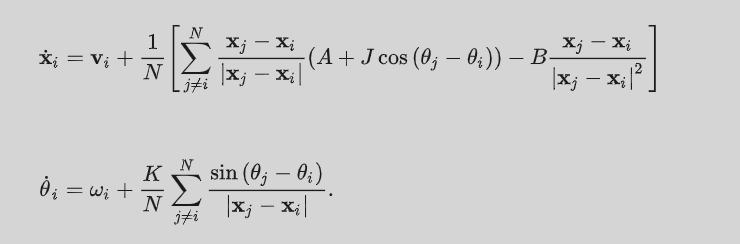

# Swarmalator

## Introduction

**Swarmalators** are agents that simultaneously **swarm** (move in space) and **sync** (oscillate in phase). This unique combination of spatial and phase dynamics leads to emergent collective behaviors including static sync, static async, active phase waves, and splintered phase waves. The model reveals rich phase transitions and critical phenomena at the intersection of swarming and synchronization. This project provides a Python simulation framework with Numba acceleration for large-scale experiments, an interactive web demo for real-time visualization and exploration, and an HPC analysis suite for extracting critical exponents and phase transition properties. Several additional model extensions are implemented, including:

- Swarmalators with variable phase coupling strength
- Swarmalators with variable internal phase change rates
- Swarmalators with intrinsic movement based on internal phase change
- Predator implementation with variable hunting strength

## Project Summary

**Computational study of coupled oscillators that sync and swarm**

Implementation based on the model by O'Keeffe et al. (2017): [Oscillators that sync and swarm](https://www.nature.com/articles/s41467-017-01190-3)

## Overview

Swarmalators are particles that exhibit both collective swarming (spatial attraction) and synchronization (phase coupling). This project provides:

- **Python simulation framework** with Numba acceleration for large-scale experiments
- **Interactive web demo** for real-time visualization and exploration
- **HPC analysis suite** for extracting critical exponents and phase transition properties
- **Order parameter tracking**: Correlation (S), synchrony (R), spatial velocity (V), phase velocity (Ω)

The system exhibits diverse collective states depending on coupling parameters J (spatial) and K (phase):

- **Static Sync**: Synchronized phases, stationary cluster
- **Static Async**: Unsynchronized phases, stationary cluster
- **Active/Static Phase Wave**: Correlated spatial-phase patterns
- **Splintered Phase Wave**: Fragmented phase clusters



## Installation

Instead of a `requirements.txt` file, this project uses `uv` to manage dependencies. See `pyproject.toml` for details.

```bash
uv venv
uv sync
source .venv/bin/activate  # Linux/Mac
# or .venv\Scripts\activate on Windows
```

> **Note for Windows Users (OneDrive):** If you encounter file permission errors (e.g., `os error 32` or hardlink failures), use copy mode:
>
> ```bash
> uv sync --link-mode=copy
> ```

### Alternative Installation (pip)

If you prefer standard `pip` or encounter issues with `uv`:

```bash
# Create and activate virtual environment
python -m venv .venv
# On Windows: .venv\Scripts\activate
# On Mac/Linux: source .venv/bin/activate

# Install dependencies from pyproject.toml
pip install .
```

## Documentation

API documentation is auto-generated from docstrings using [pdoc](https://pdoc.dev/).

### View Documentation

Open the pre-generated docs directly:

```bash
# Windows
start docs\index.html

# Mac/Linux
open docs/index.html
```

Or launch a live server with auto-refresh:

```bash
pdoc src hpc
```

This opens at <http://localhost:8080>

### Regenerate Documentation

After modifying docstrings, regenerate the HTML files:

```bash
pip install pdoc  # if not installed
pdoc src hpc -o docs
```

## Testing

The project includes a comprehensive test suite using [pytest](https://pytest.org/).

### Run Tests

```bash
pip install pytest  # if not installed
pytest .            # run all tests
pytest . -v         # verbose output
pytest . -x         # stop on first failure
```

### Test Coverage

| Module | Tests | Coverage |
|--------|-------|----------|
| `src/swarm.py` | 20 | Initialization, stepping, order parameters, stability analysis |
| `src/run.py` | 7 | Parameter validation, determinism, CSV output format |

Tests verify:

- Parameter validation via assertions
- Array shape correctness
- Order parameter bounds (S, R ∈ [0,1])
- Numba vs naive implementation consistency
- Deterministic seeding behavior

## Usage Examples

The core simulation is controlled via the `src/run.py` CLI.

### 1. Run a Single Simulation

Run a simulation with specific parameters and save the final state order parameters to `test.csv`.

```bash
python -m src.run --N 500 --J 1.0 --K -0.5 --dt 0.1 --steps 5000 --seed 42
```

**Output:**

- Prints final order parameters to stdout.
- Appends final state summary to `test.csv`.
- Saves trajectory snapshots (if `--sample_every` is set) to `src/logs/temp_N500_J1.0_K-0.5_seed42.csv`.

### 2. Parameter Sweep

Run a parallel parameter sweep over J and K.

```bash
# Sweep J from 0.5 to 1.0 and K from -1.0 to 0.5 with 4 parallel workers
python -m src.run \
  --sweep \
  --N 200 \
  --Jmin 0.5 --Jmax 1.0 --Jsteps 10 \
  --Kmin -1.0 --Kmax 0.5 --Ksteps 10 \
  --workers 4 \
  > sweep_results.csv
```

**Output:**

- The script prints CSV-formatted results to stdout, which can be redirected to a file (e.g., `sweep_results.csv`).
- Individual simulation logs (snapshots) are saved to `src/logs/`.

**Pre-computed Dataset:**

The file `src/results_data/N200_30_seed.csv` (37 MB) contains results from a comprehensive J-K parameter sweep on Snellius HPC cluster:

- **N = 200** swarmalators
- **J**: 0.0 to 1.0 (step 0.01)
- **K**: -0.8 to 0.2 (step 0.01)
- **30 seeds** per (J, K) combination
- Columns: `N, J, K, seed, R, S, V, omega, state`

This dataset is used by plotting functions in `src/plots.py` for generating phase diagrams and heatmaps.

### 3. Quick Demo

To run a pre-configured demo simulation with animation:

```bash
python main.py
```

---

## AI Usage

This project was developed with assistance from AI tools:

- **Code refactoring**: Claude assisted in simplifying analysis scripts to remove verbose AI-generated patterns
- **Documentation**: AI helped generate docstrings, README structure, and usage examples
- **Analysis implementation**: Statistical testing frameworks and critical exponent extraction methods were developed collaboratively

All code has been manually reviewed and tested. The core physics implementation and experimental design are human-driven.

---

## Directory Structure

Both `src/` and `hpc/` are Python packages with `__init__.py` files, enabling clean imports:

```python
from src.swarm import Swarm
from src.plots import plot_phase_heatmap
```

### `src/` - Core Simulation Library

The core Python implementation of the Swarmalator model.

| File | Description |
| --- | --- |
| `swarm.py` | Main `Swarm` class implementing the physics engine. Supports optional Numba acceleration for $O(N)$ predator dynamics and optimized $O(N^2)$ pairwise interactions. |
| `run.py` | CLI entry point for running simulations. Supports single runs and parameter sweeps using multiprocessing. |
| `plots.py` | Utilities for generating heatmaps, phase diagrams, and order parameter plots. |
| `benchmark.py` | Performance testing script comparing NumPy vs. Numba implementations. |
| `transient_times.py` | Analysis script for calculating relaxation times to stable states. |

**Logging & Outputs:**

- **Intermediate Logs**: `run.py` writes snapshot logs (every `--sample_every` steps) to `src/logs/`.
  - Format: `temp_N{N}_J{J}_K{K}_seed{seed}.csv`
- **Final States**: Summaries of the final simulation state (order parameters, cluster diagnostics) are appended to CSV files (e.g., `test.csv` or as configured in scripts).
- **Plots**: Generated visualizations (heatmaps, phase diagrams, order parameter plots) are saved to `plots/` (root level).
- **Results Data**: Processed analysis results (transient times, aggregated statistics) are saved to `src/results_data/`.

---

### `hpc/` - High Performance Computing Simulations

Scripts for running parameter sweeps and phase transition analysis on HPC clusters.

> **Note on Data Storage**: These scripts are designed for Snellius HPC cluster submission. Full experimental runs generate datasets exceeding 1 GB, which cannot be uploaded to GitHub (even with LFS). Results are stored locally in `hpc/results/` (which is gitignored).

**Simulation Runners:**

| File | Description |
| --- | --- |
| `run_ksweep.py` | Continuous K-sweep for observing phase transitions (imports from `src/swarm.py`) |
| `run_hysteresis.py` | Forward + backward sweeps to detect hysteresis |

**Analysis Scripts (`hpc/analysis/`):**

| File | Description |
| --- | --- |
| `analyze_beta.py` | Extract critical exponent β via log-log regression |
| `analyze_fss.py` | Finite-size scaling analysis for critical exponents |
| `analyze_hysteresis.py` | Compare forward/backward sweeps for hysteresis loops |

**HPC Job Scripts (`hpc/scripts/`):**

| File | Description |
| --- | --- |
| `submit_sweep.sh` | SLURM script for parameter sweeps |
| `submit_ksweep.sh` | SLURM script for K-sweep experiments |
| `submit_hysteresis.sh` | SLURM script for hysteresis runs |

#### Local Testing (Small N)

For local testing before HPC submission, use these reduced parameter sets:

```bash
# Quick K-sweep (outputs to hpc/results/test/)
python hpc/run_ksweep.py \
  --N 50 \
  --J 0.5 \
  --Kmin -1.0 \
  --Kmax 0.2 \
  --dK 0.05 \
  --steps_per_K 500 \
  --log_interval 10 \
  --output hpc/results/test/ksweep_N50.csv

# Parameter sweep (outputs to stdout, redirect to file)
python -m src.run \
  --N 30 \
  --sweep \
  --Jmin 0.5 --Jmax 1.0 --Jsteps 5 \
  --Kmin -1.0 --Kmax 0.5 --Ksteps 5 \
  --workers 4 \
  > hpc/results/test/sweep_N30.csv

# Hysteresis test (30 seeds, outputs to hpc/results/test/hysteresis/)
python hpc/run_hysteresis.py \
  --n_seeds 5 \
  --n_workers 4 \
  --output_dir hpc/results/test/hysteresis
```

#### HPC Production Runs

For Snellius cluster (large N, full parameter ranges):

```bash
# Submit via SLURM scripts
sbatch hpc/scripts/submit_ksweep.sh    # N=100-400, outputs to hpc/results/ksweep/
sbatch hpc/scripts/submit_sweep.sh     # Full J/K grid, outputs to hpc/results/sweep/
sbatch hpc/scripts/submit_hysteresis.sh # 30 seeds, outputs to hpc/results/hysteresis/
```

#### Analysis Scripts

All analysis scripts read from `hpc/results/` and save outputs to the same directory.

```bash
# Critical exponent β (requires ksweep data)
python hpc/analysis/analyze_beta.py \
  --data_dir hpc/results/ksweep \
  --Kc_file hpc/results/Kc.json \
  --output_dir hpc/results/beta_analysis

# Finite-size scaling (requires multiple N values)
python hpc/analysis/analyze_fss.py \
  --data_dir hpc/results/fss \
  --N_values 10 20 40 \
  --output_dir hpc/results/fss_analysis

# Hysteresis analysis (requires forward/backward sweep data)
python hpc/analysis/analyze_hysteresis.py \
  --forward_dir hpc/results/hysteresis/forward \
  --backward_dir hpc/results/hysteresis/backward \
  --output_dir hpc/results/hysteresis_analysis
```

**Output files:**

- Analysis scripts generate: `*.png` (plots), `*.csv` (statistics), `*.json` (fitted parameters)
- All outputs saved to respective `--output_dir` directories

---

### `demo/` - Interactive Web Visualization

Browser-based interactive swarmalator simulation.

| File | Description |
| --- | --- |
| `index.html` | Main page with controls and visualization canvas |
| `simulation.js` | JavaScript implementation of swarmalator dynamics |
| `style.css` | Styling for the demo interface |

**Features:**

- Real-time visualization of swarmalator dynamics
- Adjustable parameters: J (spatial coupling), K (phase coupling), N (particle count)
- Order parameter plots: S (correlation), V (velocity), Ω (phase velocity), R (synchrony)
- Preset configurations for different collective states
- Predator mode: click to spawn, right-click to remove

**To run:**

```bash
# Option 1: Open directly
open demo/index.html

# Option 2: Local server (recommended)
python -m http.server 8000 --directory demo
# Then visit http://localhost:8000
```
