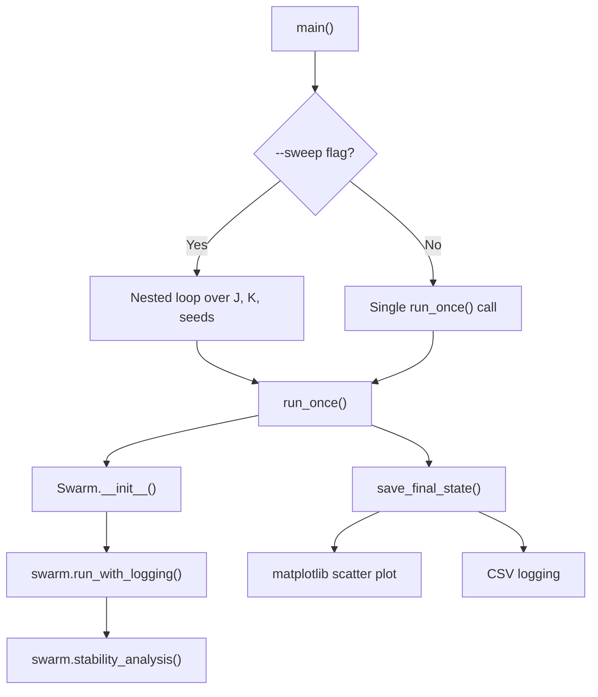

# run.py Documentation

This document provides a detailed breakdown of the `run.py` script, which serves as the main entry point for running Swarmalator simulations with parameter sweeps and logging capabilities.

---

## Overview

`run.py` orchestrates Swarmalator simulations by:
1. Parsing command-line arguments for simulation parameters
2. Running single simulations or parameter sweeps over J (phase attraction) and K (spatial coupling)
3. Saving final state visualizations as PNG images
4. Logging order parameters to CSV files

---

## Function Call Flow



---

## Functions

### `main()`

**Location:** Lines 83–123

**Purpose:** Entry point that parses CLI arguments and dispatches to `run_once()`.

**Arguments parsed:**

| Argument | Type | Default | Description |
|----------|------|---------|-------------|
| `--N` | int | *required* | Number of swarmalators |
| `--J` | float | 0.0 | Phase attraction strength |
| `--K` | float | 0.0 | Spatial coupling strength |
| `--seed` | int | 0 | Random seed |
| `--dt` | float | 0.1 | Time step size |
| `--steps` | int | 10000 | Number of simulation steps |
| `--burnin` | int | 2000 | Burn-in steps before sampling |
| `--sample_every` | int | 100 | Logging interval |
| `--sweep` | flag | - | Enable parameter sweep mode |
| `--Jmin` | float | 0.0 | Minimum J for sweep |
| `--Jmax` | float | 1.0 | Maximum J for sweep |
| `--Jsteps` | int | 26 | Number of J values |
| `--Kmin` | float | -0.8 | Minimum K for sweep |
| `--Kmax` | float | 0.2 | Maximum K for sweep |
| `--Ksteps` | int | 26 | Number of K values |

**Behavior:**
- If `--sweep` is set: iterates over `Jsteps × Ksteps × 3 seeds` combinations
- Otherwise: runs a single simulation with the specified parameters
- Prints CSV-formatted output to stdout: `N,J,K,seed,R,S,state`

---

### `run_once(N, J, K, seed, dt, steps, burnin, sample_every)`

**Location:** Lines 50–80

**Purpose:** Execute a single simulation run.

**Parameters:**

| Parameter | Type | Description |
|-----------|------|-------------|
| `N` | int | Number of agents |
| `J` | float | Phase attraction |
| `K` | float | Spatial coupling |
| `seed` | int | Random seed |
| `dt` | float | Time step |
| `steps` | int | Total steps |
| `burnin` | int | Burn-in period (currently unused in code) |
| `sample_every` | int | Log interval |

**What it does:**
1. Sets `np.random.seed(seed)` for reproducibility
2. Creates a `Swarm` instance with parameters:
   - `chirality=False`
   - `phase_coupling=False`
   - `predator=False`
3. Calls `swarm.run_with_logging()` to run simulation and log to CSV
4. Calls `swarm.stability_analysis()` to classify final state
5. Calls `save_final_state()` to save visualization and log final metrics
6. Returns formatted string: `"{N},{J},{K},{seed},{R_parameter},{S_parameter},{state}"`

---

### `save_final_state(swarm, N, J, K, seed, state, log_path)`

**Location:** Lines 11–46

**Purpose:** Save two outputs:
1. A scatter plot visualization of final agent positions
2. A CSV log entry with final order parameters

**Parameters:**

| Parameter | Type | Description |
|-----------|------|-------------|
| `swarm` | Swarm | The simulation object |
| `N` | int | Number of agents |
| `J` | float | Phase attraction |
| `K` | float | Spatial coupling |
| `seed` | int | Random seed |
| `state` | str | Classified state (unused in current implementation) |
| `log_path` | str | Path to CSV log file |

---

## Output Files

### 1. Final State Images

**Directory:** `final_states/`

**Filename format:** `swarmalator_N{N}_J{J}_K{K}_seed{seed}.png`

**Content:** Matplotlib scatter plot showing:
- X-axis: Agent x-positions
- Y-axis: Agent y-positions
- Color: Agent phases (using HSV colormap)
- Colorbar: Phase values (theta)
- Title: Parameter summary

**Example:** `final_states/swarmalator_N100_J0.5_K-0.2_seed0.png`

---

### 2. Temporal Order Parameter Logs

**Directory:** `logs/`

**Filename format:** `temp_N{N}_J{J}_K{K}_seed{seed}.csv`

**Generated by:** `swarm.run_with_logging()`

**Columns:**

| Column | Type | Description |
|--------|------|-------------|
| `step` | int | Simulation step number |
| `S` | float | Correlation order parameter (phase-position correlation) |
| `V` | float | Mean spatial velocity magnitude |
| `omega` | float | Mean phase angular velocity |
| `R` | float | Kuramoto synchrony order parameter |
| `J` | float | Phase attraction strength |
| `K` | float | Spatial coupling strength |
| `N` | int | Number of agents |
| `state` | str | Classified state label |

**Logging frequency:** Every `sample_every` steps (default: 100)

---

### 3. Final State Summary Log

**Filename:** `test.csv` (hardcoded in `run_once()`)

**Generated by:** `save_final_state()`

**Columns:**

| Column | Type | Description |
|--------|------|-------------|
| `J` | float | Phase attraction strength |
| `K` | float | Spatial coupling strength |
| `N` | int | Number of agents |
| `S` | float | Final correlation order parameter |
| `V` | float | Final mean spatial velocity |
| `omega` | float | Final mean phase velocity |
| `R` | float | Final Kuramoto order parameter |
| `state` | str | Final classified state |
| `seed` | int | Random seed used |

---

## State Classification

The `stability_analysis()` method classifies the final state into one of:

| State | Conditions |
|-------|------------|
| **Static Phase Wave** | V < 0.01, ω < 0.01, S > 0.1, low separation |
| **Splintered Phase Wave (k=N)** | V < 0.01, ω < 0.01, S > 0.1, high separation & compactness |
| **Static Sync** | V < 0.01, ω < 0.01, S ≤ 0.1, R > 0.9 |
| **Static Async** | V < 0.01, ω < 0.01, S ≤ 0.1, R ≤ 0.9 |
| **Active Phase Wave** | S > 0.1, V ≥ 0.01, ω ≥ 0.01 |
| **Transitioning** | Other cases |

---

## Usage Examples

### Single Run
```bash
python run.py --N 100 --J 0.5 --K -0.3 --seed 42 --steps 5000
```

### Parameter Sweep
```bash
python run.py --N 100 --sweep --Jmin 0 --Jmax 1 --Jsteps 11 --Kmin -1 --Kmax 0.5 --Ksteps 16 > sweep_results.csv
```

---

## Dependencies

- `numpy` - Numerical operations
- `matplotlib` - Visualization
- `argparse` - CLI parsing
- `csv` - CSV file I/O
- `pathlib` - Path handling
- `src.swarm.Swarm` - Core simulation class
